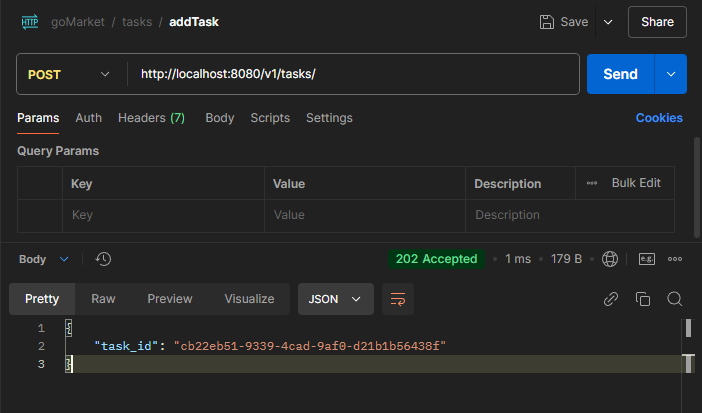
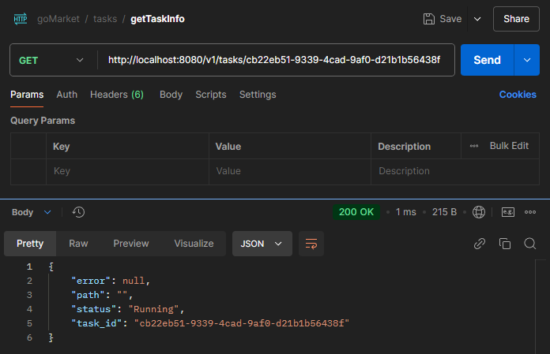
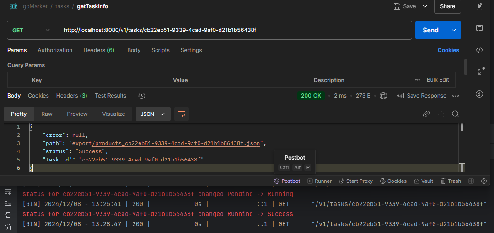
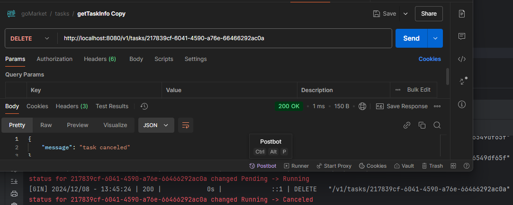
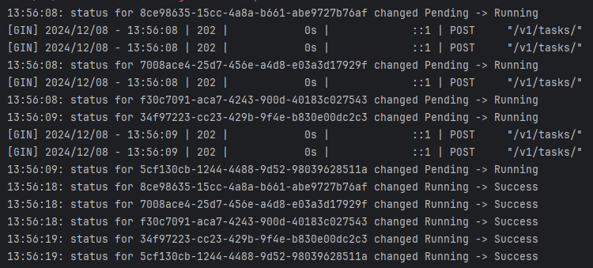
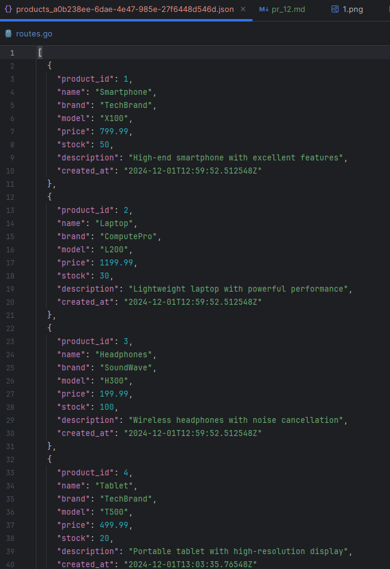

## Практическая работа 12

### Выполнил студент группы ЭФМО-02-24 Трофимович Кирилл

### Добавление задачи на экспорт товаров

### Запрос на получение статуса задачи во время выполнения

### Запрос на получение статуса задачи после успешного завершения, все изменения статусов задач дополнительно логируются в консоль

### Возможность отмены задачи, все изменения статусов задач дополнительно логируются в консоль

### Создадим одновременно 5 задач и убедимся что они выполняются параллельно

### Так выглядит сохраненный файл

