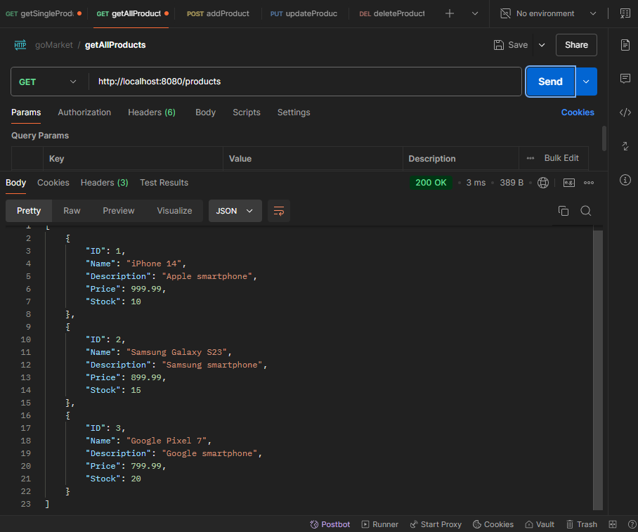
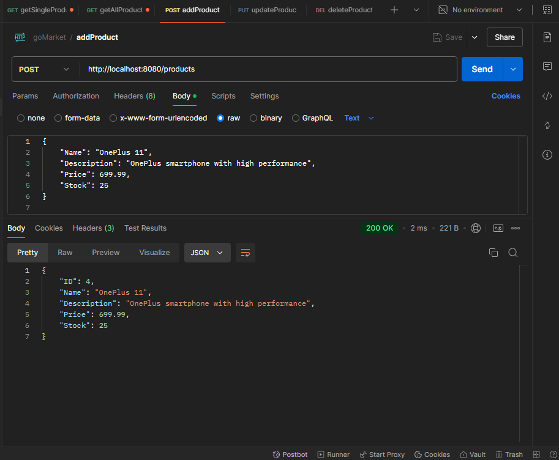
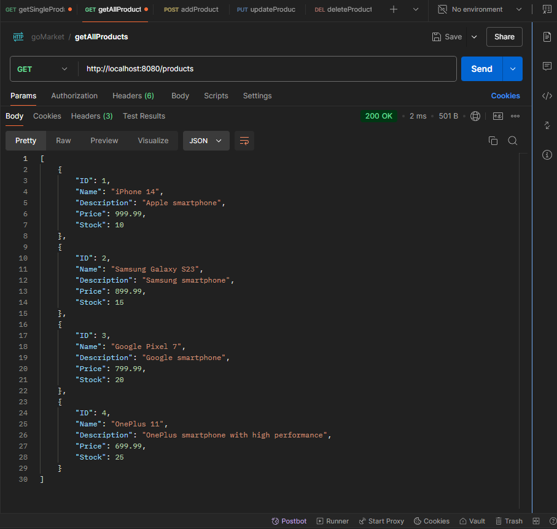
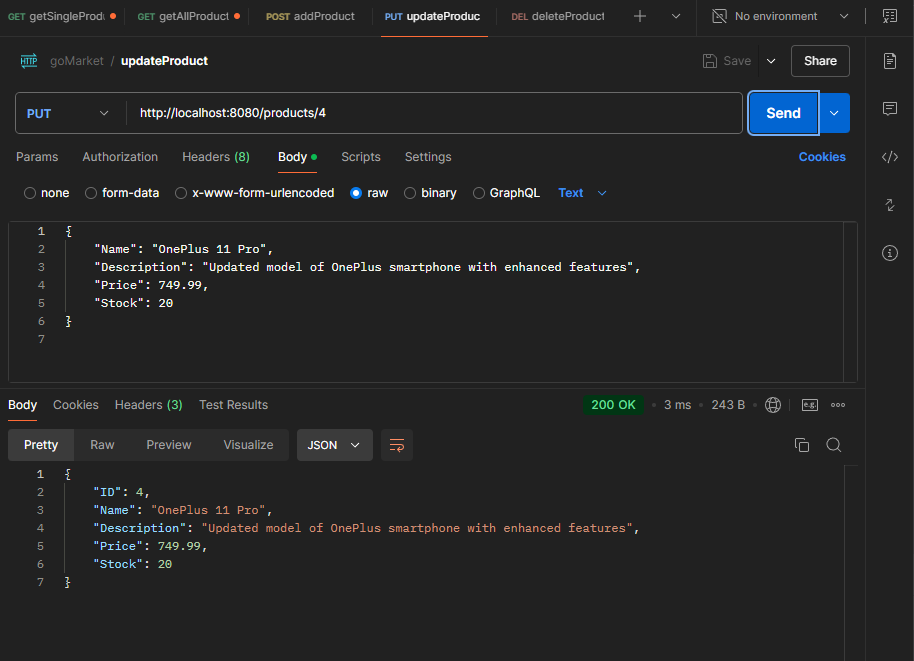
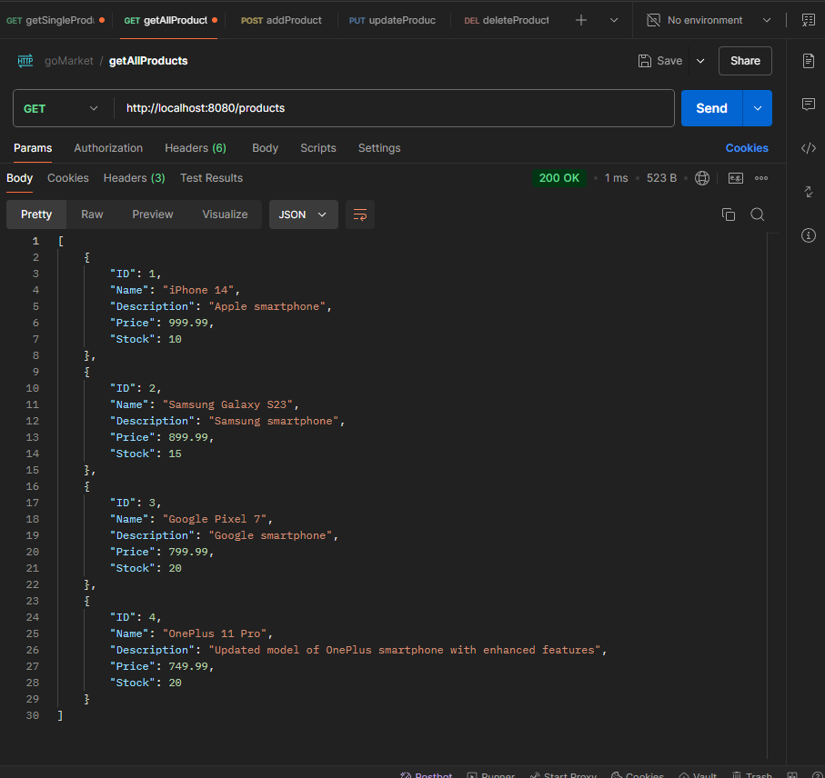
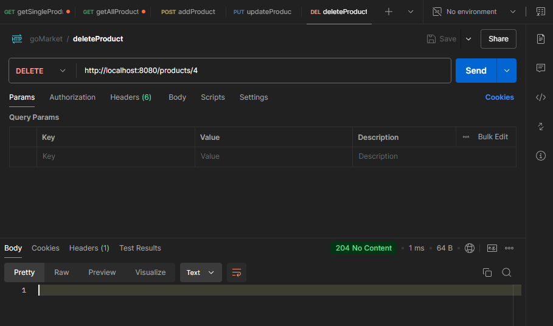
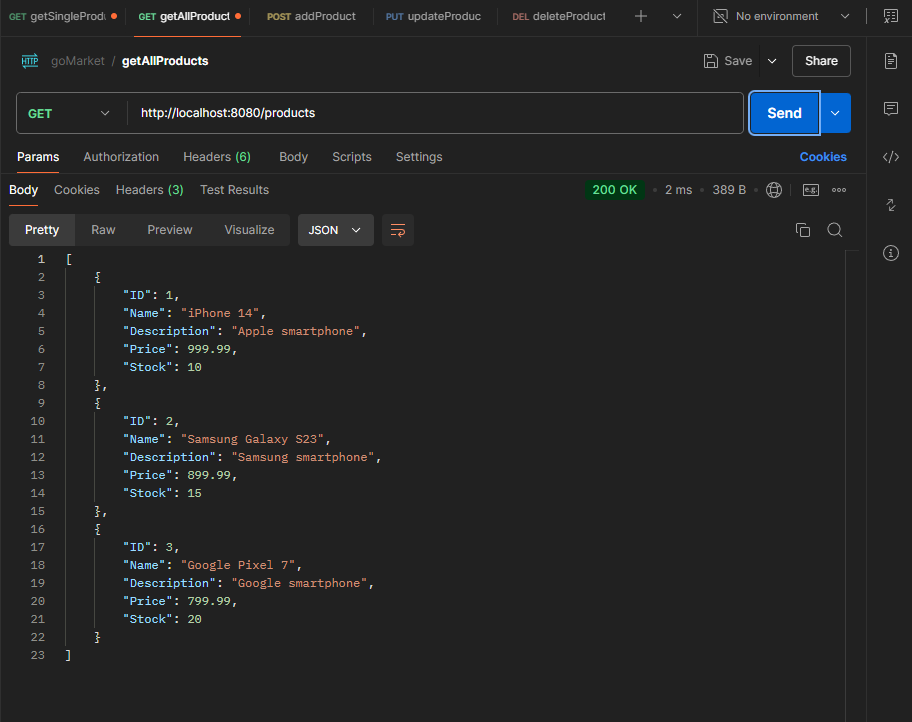
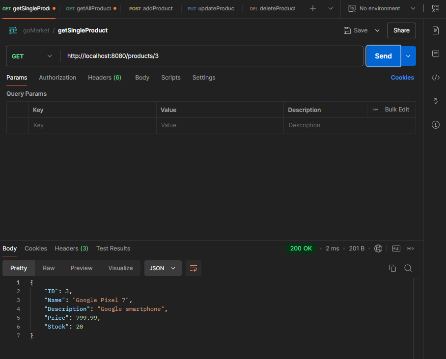

## Получение всех товаров

## Добавление товара и последующая проверка, что он добавился

## Изменение цены товара и последующая проверка, что изменение прошло успешно

## Удаление товара и проверка, что он удалился

## Получение товара по id

